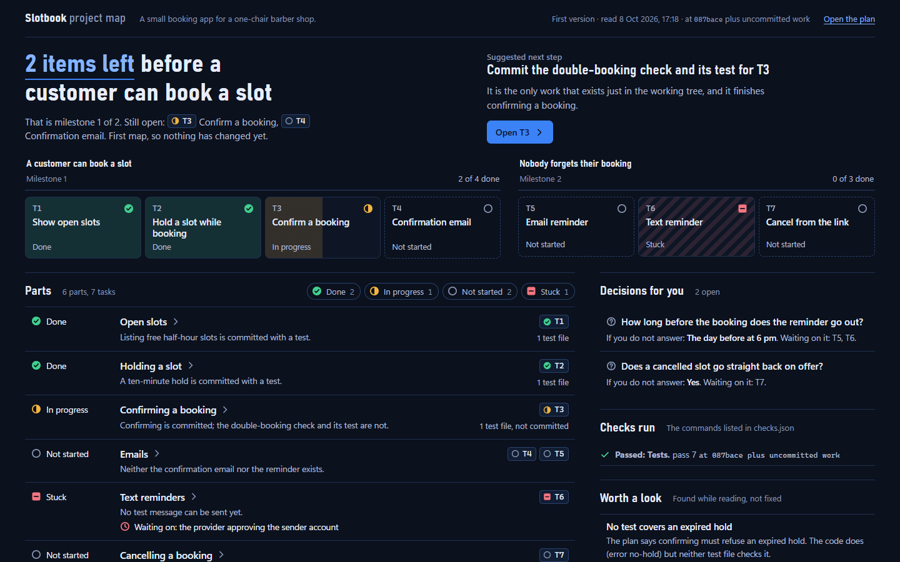
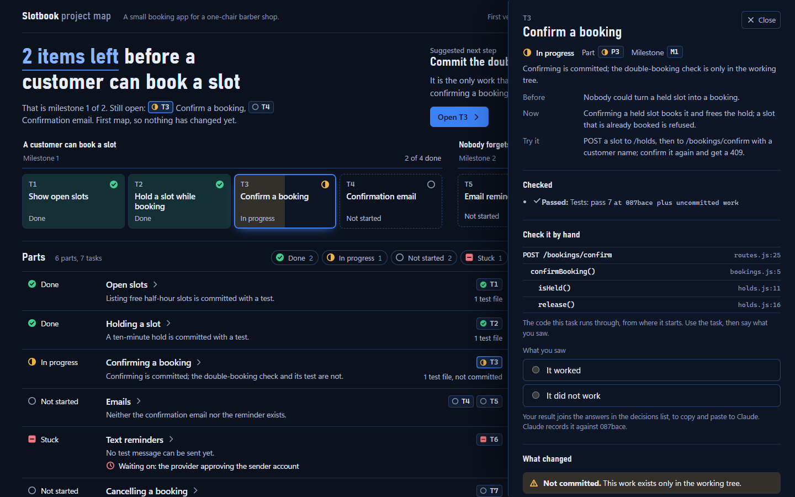

# build-compass



**Know where your project stands without reading the transcript.**

When Claude Code works on its own for an hour, the only record of what happened is a transcript nobody wants to read. build-compass makes Claude keep one page up to date as it works: what is done, what is in progress, what is stuck and on what, and what to do next. Open it with a double-click, any time.

```bash
claude plugin marketplace add a-pavithraa/build-compass
claude plugin install build-compass@a-pavithraa
```

Then, once, inside Claude Code: `/build-compass:setup`

The picture above is a real map, drawn by this plugin for a made-up booking app.

## What it does for you

- **Before a long run,** Claude draws the map, so you have something to open while it works.
- **As work lands,** the map is updated: after each milestone, and whenever you ask. Setup lets you choose how often.
- **When you ask "where are we?",** Claude answers from the map: the next milestone, how many items are left, what changed, what is stuck. It reads a short summary of the map instead of the whole data file, so the answer is quick and cheap.
- **When you open a session and the map is out of date with the code,** Claude is told so at the start, and updates it before relying on it.
- **For every finished task,** you can open it and see what changed: what was true before and what is true now, one way to try it, which checks were run on it, whether it is committed and pushed, and the files it touched.
- **When you come back to the map,** it lists what moved since you last looked, however many updates happened in between.
- **When something needs your call,** it appears on the map as a decision with the default Claude will take if you do not answer.



## What is in the plugin

Six pieces. You only ever type two of them.

| Piece | Kind | What it is for | When it runs |
|---|---|---|---|
| [`project-map`](./agents/project-map.md) | Agent | Reads the project and writes the map's data. A ready-made page draws it. | When Claude sends it, in the background. |
| [`mapping-progress`](./skills/mapping-progress/SKILL.md) | Skill | Tells Claude when to update the map and how to answer from it. | On its own: before long runs, after milestones, on "where are we?". |
| [`grill-page`](./skills/grill-page/SKILL.md) | Skill | Lets you answer Claude's questions about a plan by clicking in a page, in place of typing. | When you say "grill me in a page". |
| [`hooks.json`](./hooks/hooks.json) | Hook | Tells Claude when a session starts and the map is out of date: a different commit is checked out, or the uncommitted work has changed since the map was read. Silent otherwise, and when the project has no map. | At the start of each session. |
| [`status`](./skills/status/SKILL.md) | Skill | Prints where the project stands from the map, in a few lines. It does not run the agent. | Only when you type `/build-compass:status`. |
| [`setup`](./skills/setup/SKILL.md) | Skill | Setup and check-up: checks for Node, git and the companion skills, saves your map style, sets how often the map updates with a pointer in your `CLAUDE.md`, offers a first map, and reports what works. Safe to run again. | Only when you type `/build-compass:setup`. |

The map and the grilling page are separate tools that share a plugin because they are two ends of the same job: deciding what to build, then seeing how the build is going.

## A piece of work, start to finish

The plugin is useful on its own. With two other people's skills installed beside it, it covers a piece of work from idea to finished. Say you want to add reminders to a booking app:

1. **You say "grill me in a page".** Claude works out what it would otherwise have to guess: how long before the booking does the reminder go out, what happens if the text message fails. The questions open in your browser. You click answers, press **Copy answers**, and paste one block back. *(grill-page, using Matt Pocock's `grilling`)*
2. **You confirm the decisions.** They are saved to `.grill/decisions.md`.
3. **Claude writes a plan** as a page you can read in a minute, stating what you already decided and asking only what is still open. You answer it in the page. *(Thariq Shihipar's `html-plan`)*
4. **Claude builds.** Before it starts, the map is drawn. *(project-map)*
5. **You check in whenever you like.** Open the map, or ask "where are we?". *(project-map)*

Claude waits for you at steps 2 and 3. It does not carry on with a default there. Defaults apply only to decisions that come up while building.

## The skills it works with

Both are optional and belong to their authors. Setup tells you which ones you have.

### grilling, by Matt Pocock

*Needed for `grill-page`.* An interview that will not let a plan stay vague. Claude maps your plan as a tree of decisions, where each decision opens further ones, and asks about them in rounds: every question it can ask now without guessing an answer it has not heard yet. Each question comes with Claude's recommended answer. Facts it can look up, it looks up; decisions are always put to you. It ends when no branch is left unvisited, and nothing is built until you confirm.

On its own, a round arrives as numbered questions in chat and you type a reply to each. `grill-page` keeps the interview and changes the delivery: the round becomes a page of options to click.

```bash
claude plugin install mattpocock-skills
```

Source: [mattpocock/skills](https://github.com/mattpocock/skills), MIT.

### html-plan, by Thariq Shihipar

*Needed only if you want maps built from plans.* It writes an implementation plan as one HTML page. The plan is a tree of claims: what someone can now do, how that works, and where in the code. Each claim is backed by one exhibit, such as a mockup, a call stack or a schema. The decisions you need to make sit on the claim they change. You pick options, comment, press **Respond**, and paste one answer back.

When a project has such a plan, the map is built from it: each top-level claim becomes a part, the claims under it become tasks, and the plan's unanswered decisions show on the map until you answer them in the plan. A claim keeps its place on the map when the plan is reworded or renumbered. When you paste your response to the plan, it is saved, so the map knows the plan was answered. If the plan changes after that, the map shows it as waiting for you again.

```bash
claude plugin marketplace add anthropics/claude-plugins-community
claude plugin install html-plan@claude-community
```

Source: [anthropics/claude-plugins-community](https://github.com/anthropics/claude-plugins-community), MIT.

## The map

- **Top of the page:** how many items are left before the next milestone, one suggested next step with its reason, and which parts changed since the last update.
- **Since you last looked:** every status that moved and every decision answered since you last pressed **Mark as seen**. It is remembered in your browser, so it covers all the updates in between.
- **Tasks:** a done or in-progress task opens with before, now and one way to try it, then the checks Claude ran on it, then the commits and files. A task with no recorded check says so.
- **Parts:** four to eight main parts, each with one status and a one-line reason. Stuck parts say what they are waiting on.
- **Milestones:** yours if you have named them. If not, the agent reads the README and commit history and proposes a first version, marked as proposed until you edit it.
- **Decisions:** anything that needs your call, with the options and the default.
- **Something of its own:** when a project calls for it, the agent adds a table or a list, such as the screens a user will see or what a release still needs. Only from real data.

Everything is clickable. Parts, tasks, milestone items and decisions open their detail; the same item is selected in every panel it appears in; the status legend filters the page.

**Your style, asked once.** Dark or light, and one accent color. Every map on your machine uses it.

**Two files.** `.project-map/map.html` is the page, the same for every project. `.project-map/map-data.js` is your project. Milestones live in the data file; edit them there and the agent keeps your edits. A page opened from disk cannot save itself, so your picks on decisions collect in one block of answers under the decision list. Press **Copy answers** and paste it to Claude once. Picks survive the page's own reloads, and each one clears itself once the map records your answer.

**It stays current.** Leave the map open in a tab. It reloads itself when the data changes. In a terminal, `node <plugin>/map/status.mjs` prints the same state in a few lines, and says whether the map is out of date with the code.

**Status comes from the code.** A detailed plan does not count as progress, and an unanswered plan does not reset work that exists. Whether a plan is approved is shown separately.

## What it costs

Measured on the example project in the screenshot, with the default Sonnet model: the first map took about 54,000 tokens and under a minute, and an update after a finished task about 37,000 tokens and 46 seconds. Larger projects cost more to read.

Each update is one run of the agent, so how often it runs is the main cost. Setup offers three settings: after milestones (the default), after every finished task, or only when you ask. Claude skips an update that would change nothing and sends tasks that finish close together in one update. `/build-compass:status` and "where are we?" read the map without running the agent.

It is cheap because the agent does not draw anything. The page ships with the plugin; the agent reads your project and writes a small data file. An earlier version drew a new page on every run and cost 100,000 to 200,000 tokens and 7 to 15 minutes each time.

## Grilling in a page

Ask Claude to "grill me in a page" about whatever you are planning.

- Each question shows its options, with Claude's recommendation tagged. You click to answer, including to agree.
- Every question has a "Something else" box and room for a note.
- One **Copy answers** button gives you a block to paste back. Anything you did not answer is reported as unanswered, never as agreement.
- When Claude writes the next round, the open tab loads it by itself. If you are in another tab, its title changes and its icon blinks.
- Half-finished answers survive a refresh, and are thrown away if the questions change.

## What the agent reads and writes

It reads the code, git history, the README and docs, plans, and GitHub issues and pull requests if the `gh` CLI is set up.

It writes to `.project-map/` in the project, adds that folder to `.gitignore`, and keeps the last 20 versions of the data in `.project-map/history/`. Commits, file lists and line counts come from a script that reads git, not from the model, and every hash and path on the map is checked against git before the map is shown. It does not change project code, commit, or run builds and tests.

That boundary is an instruction in the agent's prompt, not a sandbox. The agent has shell access so it can read git history. If you need a hard guarantee, add a permission rule or hook of your own.

## Limits

- Statuses come from what the agent reads: commits, code, issues, plans. It does not run your tests, so "done" means the evidence says so. The checks shown on a task are the ones Claude said it ran; the agent records them and does not repeat them.
- The map is a snapshot. On a fast-moving branch it can be a task behind by the time it is written. A new session is told when the map is out of date; a running one is not.
- `.grill/` and `.project-map/` are ignored by git, so the decisions file and the map stay on your machine. Copy `decisions.md` into your docs if the team needs it.
- Every project gets the same page. The layout does not adapt to the project beyond an added table or list.
- The agent runs on Sonnet by default. It judges status from what it reads, and on a large or tangled project it can group things in a way you would not. Edit the data file, or tell Claude, and it keeps your version.

## Settings

The agent's frontmatter sets `model: sonnet`, `effort: medium` and `memory: user`. To change any of these, for example to `opus` for sharper judgement at a higher cost, copy `agents/project-map.md` into `~/.claude/agents/` and edit your copy.

To change the map style, tell Claude the new theme or accent.

## Manual install

If you would rather not use the plugin, copy the pieces into your own folders:

```bash
mkdir -p ~/.claude/agents ~/.claude/skills ~/.claude/project-map
cp agents/project-map.md ~/.claude/agents/
cp map/map.html map/check.mjs map/gather.mjs map/plan-extract.mjs map/status.mjs ~/.claude/project-map/
cp -r skills/mapping-progress skills/grill-page ~/.claude/skills/
```

Then add one of the blocks in [`skills/setup/claude-md-block.md`](./skills/setup/claude-md-block.md) to your `CLAUDE.md`. For the note when a session starts with an out-of-date map, add a `SessionStart` hook to your settings that runs `node ~/.claude/project-map/status.mjs --session-start`. Do not install both ways, or you will have everything twice.

## Development

`npm test` runs the tests with Node's own test runner. They cover the map's scripts, against throwaway git repositories and a small sample plan in `test/fixtures/`; the map page, in a headless browser; and the data example in the agent's prompt, which must pass `check.mjs`. They need Node 21 or later and git. The page tests need Playwright, which the plugin does not depend on, so that installing the plugin installs nothing: run `npm install --no-save playwright@1.64.0` once, and they use an installed Chrome or Playwright's Chromium (`npx playwright install chromium`). Without Playwright they skip themselves. GitHub Actions runs them on every push.

## Credits

The idea and the first prompt come from a post by [@Voxyz_ai](https://x.com/Voxyz_ai) on X: https://x.com/Voxyz_ai/status/2107455844992299272. The prompt, and how this plugin has moved on from it, is in [docs/original-prompt.md](./docs/original-prompt.md).

`grill-page` builds on `grilling` by [Matt Pocock](https://github.com/mattpocock/skills). Its copy-one-response-back pattern follows `html-plan` by Thariq Shihipar ([@trq212](https://x.com/trq212)). The map page and the grilling page were designed against the craft floor of `impeccable` by [Paul Bakaus](https://github.com/pbakaus/impeccable); you do not need it installed.

## License

[MIT](./LICENSE)
